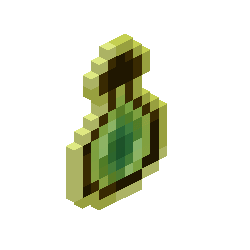
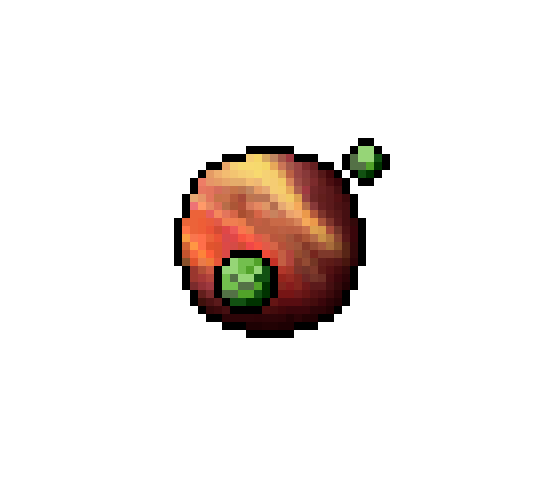

<h2 align="center">
Welcome to my GitHub profile!!
</h2>

  <strong>English Version</strong> | <a href="README.md">Russian Version</a>

    

<h3 align="center">
About me
</h3>

I'm <a href="https://aniwylle.github.io/newportfolio/" target="_blank"> Diana</a>. I'm an IT student specializing in programming at the <a href="https://spb.ithub.ru/" target="_blank">ITHUB SPB College<a/>. I have been studying programming for three years. I want to become a pro in minecraft and in gamedev

  
  
  
  

<h3 align="center">
🛠️Technologies & Tools I once used:
</h3>

  
  
  
  
  

  

  
  
  
  

<h3 align="center">
🗡️ My achievements on codewars:
</h3>

    

If you want to support me:

    
    <h4> tap here ↑</h4>
    

