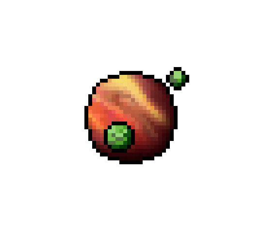

<h2 align="center">
Welcome to my GitHub profile!!
</h2>

    

<h3 align="center">
About me
</h3>

I'm Diana. I'm an IT student specializing in programming at the ITHUB SPB College. I have been studying programming for three years.

  
  
  
  

<h3 align="center">
🛠️Technologies & Tools I once used:
</h3>

    
    
    
    
    
    
    
    
    
    
    
    
    
    

<h3 align="center">
🗡️ My achievements on codewars:
</h3>

    

If you want to support me:

    

